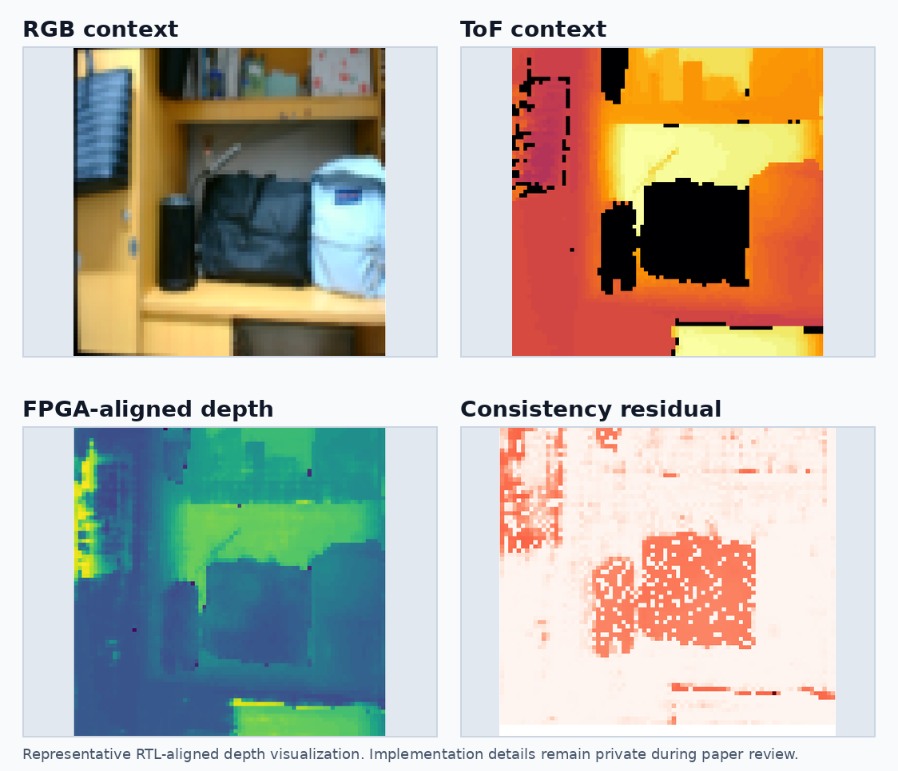

# Hi, I am zjy

I work on FPGA-oriented depth perception systems, with a current focus on
Stereo-ToF fusion, quantization-aware training, and hardware-visible deployment
validation.

## Featured Project

### FOU-Centered Stereo-ToF Fusion on FPGA

An end-to-end depth estimation project that connects a lightweight Stereo-ToF
fusion network to an FPGA-oriented deployment path. The work spans model design,
StrictQAT training, export of FPGA-consumable assets, runtime/API boundary
alignment, and RTL-visible verification closure.

| Current public metric | Value |
| --- | --- |
| FPGA inference throughput | **160x160 @ 250 FPS** |
| Best recorded test accuracy | **31.08 mm MAE / 58.41 mm RMSE** |
| Evaluation note | Full test split, 240 samples, millimeter-scale depth error |
| Verification boundary | 43-layer runtime contract and post-simulation closure |

  

This visualization is a representative deployment-facing result: RGB and ToF
context are processed into an FPGA-aligned depth output, with a residual view
used to inspect consistency against the deployment reference path.

## What This Project Covers

| Area | Public summary |
| --- | --- |
| Model design | A lightweight Stereo-ToF fusion network organized around an FPGA-aligned operator unit. |
| Quantization | Progressive training from floating point to QAT and StrictQAT for deployment-aware behavior. |
| Export path | A controlled algorithm-to-FPGA asset flow for quantized parameters, topology, and runtime metadata. |
| FPGA runtime | A runtime/API boundary that prepares FPGA-consumable execution state while preserving tensor contracts. |
| RTL validation | A full-layer verification path with runtime contract checks and post-simulation closure. |

  

## Engineering Highlights

- Built a deployment-aware Stereo-ToF fusion pipeline rather than treating FPGA
  execution as a post-training afterthought.
- Connected StrictQAT checkpoints to FPGA-oriented export artifacts and
  baseline references.
- Established a traceability path across training, export, runtime/API
  consumption, RTL simulation, and result reporting.
- Reached a current FPGA inference throughput of 160x160 @ 250 FPS.
- Recorded a best full-split test result of 31.08 mm MAE / 58.41 mm RMSE.
- Maintained a 43-layer RTL verification closure path for representative
  full-network runs.
- Produced visual depth reconstruction evidence that is inspectable at the
  deployment boundary.

  

## Current Publication Boundary

The implementation repository is currently private while the related paper is
under preparation/review. To protect unpublished methods and engineering
details, this public profile intentionally does not include:

- source code
- training or export commands
- model checkpoints or FPGA binary assets
- internal run names, directory layouts, or reproducibility scripts
- detailed RTL, runtime, or data-packing implementation

Full source code and reproducibility material are planned for public release
upon paper acceptance.

More context is available in the short public-facing [project brief](docs/project_brief.md).
