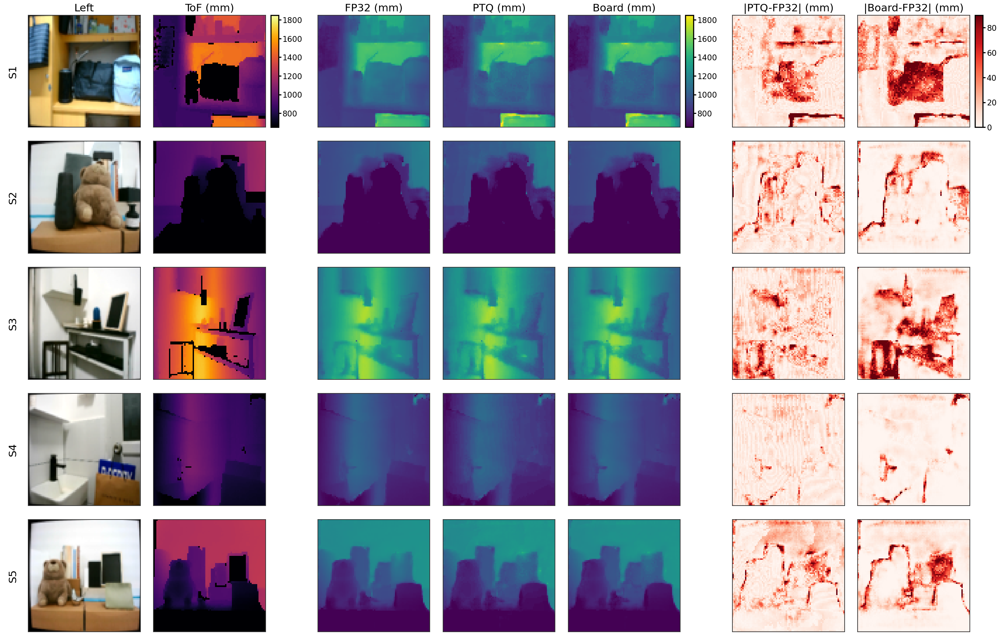
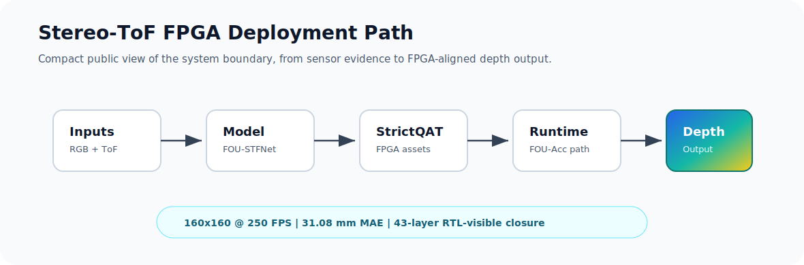
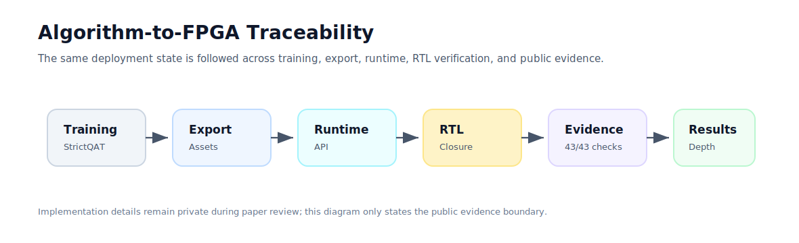

# Hi, I am zjy

I build FPGA-oriented depth perception systems, with a current focus on
Stereo-ToF fusion, quantized model deployment, RTL-visible verification, and
board-level runtime validation.

## Featured Project

### FOU-Centered Stereo-ToF Fusion on FPGA

An end-to-end model-to-board project for 160x160 depth estimation. The work
connects a lightweight Stereo-ToF fusion network with an FPGA deployment path:
FP32/PTQ modeling, FPGA-consumable asset export, runtime/API integration,
RTL/post-simulation checks, Vivado implementation, and board-side measurement.

| Public result | Value | Scope |
| --- | ---: | --- |
| FPGA runtime | **4.195 ms / 238.4 FPS** | INT8 FOU-Acc at the reported 200 MHz FPGA operating point |
| FP32 depth accuracy | **31.08 mm MAE / 58.41 mm RMSE** | Full local evaluation split, 240 samples |
| Board-vs-FP32 fidelity | **15.06 mm mean abs / 58.59 mm p95 abs** | Representative S1-S5 board scene set |
| Routed FPGA cost | **71.33% LUT / 20.76% FF / 53.37% DSP / 52.69% BRAM** | ZU9EG-class implementation, Vivado post-route |
| Power estimate | **4.423 W** | Vivado post-route on-chip estimate |
| Verification boundary | **43-layer runtime contract + RTL/post-sim + board latency-quality sync** | Deployment-facing validation path |

  

The panel above shows representative board-facing depth outputs across S1-S5.
It compares ToF input, FP32/teacher or PTQ references, FPGA board output, and
absolute-error views in millimeters.

## What This Project Covers

| Area | Public summary |
| --- | --- |
| Model design | Stereo-ToF fusion network organized around an FPGA-friendly operator path. |
| Quantized deployment | FP32-to-PTQ/INT8 deployment route with FPGA-facing parameter, topology, and metadata export. |
| Runtime integration | Board API/runtime path that consumes exported assets while preserving tensor and layer contracts. |
| RTL validation | Full-network 43-layer runtime-contract checks and post-simulation result inspection. |
| FPGA implementation | Vivado-routed accelerator implementation with reported resource and power estimates. |
| Board evidence | Board-side runtime measurement and multi-scene depth-output fidelity checks. |

## Technical Focus

- FPGA acceleration for neural-network inference and depth perception.
- Quantized model deployment across algorithm, runtime, RTL, and board layers.
- Hardware/software contract design for reproducible model-to-FPGA execution.
- Evidence-driven validation: reference comparison, RTL/post-sim inspection,
  routed implementation reports, and board-side measurement.

  

## Engineering Highlights

- Built the project as a deployment pipeline, not only as a neural-network
  experiment.
- Kept algorithm, quantization, exported assets, runtime consumption, RTL
  verification, and board measurement aligned through explicit contracts.
- Reported 4.195 ms per frame and 238.4 FPS at the 200 MHz FPGA
  operating point for 160x160 INT8 inference.
- Preserved a clear FP32 quality anchor at 31.08 mm MAE / 58.41 mm RMSE.
- Produced multi-scene board outputs that can be visually inspected against
  FP32/PTQ references.
- Maintained a 43-layer verification path from runtime contract to
  post-simulation closure and board-facing validation evidence.

  

## Current Publication Boundary

The implementation repository is currently private while the related paper is
under preparation/review. To protect unpublished methods and engineering
details, this public profile intentionally does not include:

- source code
- training or export commands
- model checkpoints or FPGA binary assets
- internal run names, directory layouts, or reproducibility scripts
- detailed RTL, runtime, or data-packing implementation

Full source code and reproducibility material are planned for public release
upon paper acceptance.

More context is available in the short public-facing [project brief](docs/project_brief.md).
